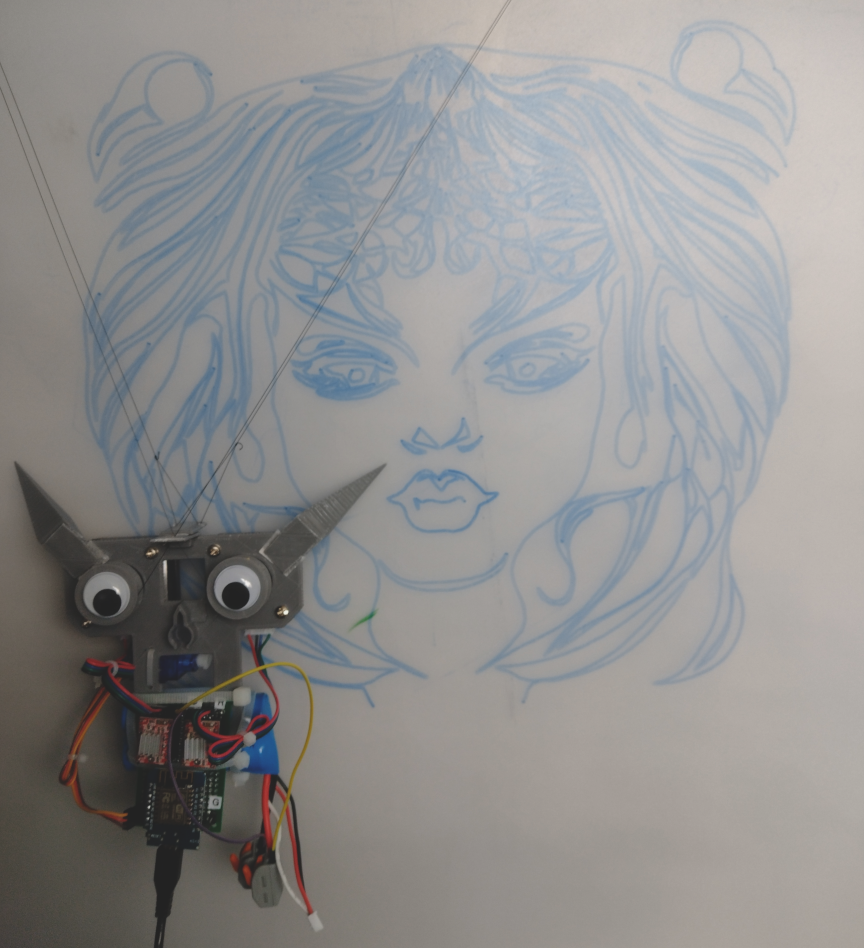

# Wall Plotter

*By Carri King and the Quantum Tech Club* 

This is a self-contained hanging plotter based around the ESP8266. Please feel free to use and modify these sources as you wish.
Please keep in mind that this is a spare time, hobby project, it's all still rather rough around the edges.

If you would like to contribute to the project I welcome that.

In this repo you will find the source code and Open JSCad (https://openjscad.xyz/) models.

The intention of this project is to build a plotter which can be quickly attached to a vertical surface, a suitable pen inserted and then the plotter can be left to independently render the picture. By using a web-interface initial configuration and control of the plotter can be done with a smartphone removing the need for any user-interface on the device itself or the need for a controlling computer.

## Features
- Uses GCODE to control the plotting process. There are a number of ways to create such code but the GCODE tools built into the Inkscape application (https://inkscape.org/) are ideal.
- Scratch built, very simple, GCODE processor designed for the ESP8266 and other small microcontrollers
- Internal web interface to control and configure the system
- Uses ESP8266 internal flash RAM for GCODE program storage with an easy interface to manage that
- Simple cooperative style multitasking allows the various systems to remain responsive 
- Supports BYJ48 stepper motors and A9888 stepper controllers

## Compiling

The .ino file located in the src directory is intended to be compiled and uploaded using the Arduino IDE. Follow the instructions to install the compiler for ESP8266 and then choose the appropriate configuration.

## Making the hardware
Contained within the models directory are the Open JSCad files that define the models that comprise the plotter hardware. Open these in Open JSCad, export them as STL, load the STL in your slicer and then print them. The plotter is made from several major assemblies. The hub holds the motors, pen and the servo mounts on the reverse side. The "ears" are stabilisers that extend to enable the plotter to have 3 points of contact and not swing around the pen. These attach to the hub with super-glue. The battery holder attaches to the hub using nuts and bolts, and holds the ESP8266, stepper interface boards, voltage converter and 2s 7.4v lipo battery. The intention is that different battery sections can be attached to the hub section, for example with a different microcontroller or battery, without having to reprint the whole thing.
The pin numbers that connect the ESP8266 to the servo and stepper controllers are contained within the .ino file, change these as needed.

## Configuring the web interface

Within the .ino are few places to put the SSID and password for the WiFi connections, find and change these as needed. I would definitely like to improve this aspect in the future.

## Using the plotter

After power on the Plotter will first attempt to connect to the compiled in external WiFi, if that fails it will then enable the access point mode.
Once a web-browser is connected to the web service then you can:
- Use the controls section to manually position the plotter and test the stepper connnections
- Upload GCODE programs to the flash RAM and execute them
- Configure the parameters related to plotting geometry. These are not currently retained in flash RAM although the defaults can be easily changed in the .ino as needed.

## Plotting geometry parameters

There are several key parameters that allow the plotter to reproduce the correct dimensions from the GCODE program.
Be aware that when the angle between the support string exceeds 100 degrees and approaches 180 degrees then the two stepping motors will be opposing each other, creating far higher current demands which is likely to lead to missed steps.
Note also that the plotter does not attempt to correct for curvature when drawing straight lines. This occurs because the motors move the plotter in arcs. If you find your creation has noticable curves in long straight lines then break those lines up into smaller segments in your art package before converting to GCODE.

### Baseline
This is the distance between the hanging points.

### Zero length
This is the length of the support strings when the plotter is at the home position. You can also reset the home position using the interactive controls.
It is assumed when the plotter is homed that both support strings are the same length.

### Smoothing
Controls whether the motors will speed up and slow down to ease into linear motions and consequently have less swing when using long supporting strings.

### Tick rate
Controls the rate which the internal GCODE processer updates. Short values mean the plotter will move quicker but can mean that in situations where high torgue is needed that steps are missed or worse the plotter will briefly fall. The best value balances speed versus the current that the batteries and stepper controllers can deliver versus the speed that the steppers can reliably step at.

### Steps per mm
This is contained within the .ino file. If you use different motors or spools then this value should be changed accordingly. Also note that if you are using folded support strings to gain a mechanical advantage for the stepper motors then the steps per mm is the distance on the plotting page not the string length which would be half that.

## Upload GCODE to the plotter
Paste the GCODE into the text area at the bottom of the UI, give the program a catchy name, and then press upload. The upload is rather slow which is also something which could be improved.
After the upload conpletes refresh the view of the flash RAM to confirm the program has been uploaded and to run it when you are ready.
Note also that the amount of storage available in the flash RAM is an estimate. I haven't gotten to the bottom of how to exactly calculate the available space as the flash RAM is shared with the executable programs and other system components.

